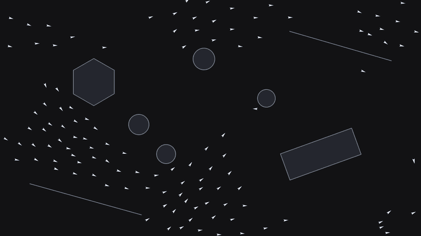

# flocking

Real-time flocking simulation with predictive obstacle avoidance, in Python and Pygame.



Final project for MIT 6.4400 (Computer Graphics), Fall 2025. Full write-up:
[docs/report.pdf](docs/report.pdf).

## Running

```bash
pip install -r requirements.txt
python main.py
```

`--scene {plain,corridor,pillars,full_scale}` · `--boids N` · `--color {mono,heading}` ·
`--seed S`. Left-click adds a boid.

One change since the report: obstacle avoidance casts three rays instead of one, straight ahead
plus shorter whiskers at ±30°. A single forward ray misses walls a boid is drifting sideways
toward, so boids slipped into obstacles; the whiskers make the motion noticeably smoother.

## Layout

```
main.py              window, input, game loop
flocking/
  config.py          simulation and display parameters
  geometry.py        ray-segment and ray-circle intersection
  walls.py           Wall interface: straight, circle, rectangle, polygon
  boid.py            one agent and its steering forces
  flock.py           owns the boids and the walls
  scenes.py          named obstacle layouts
  render.py          drawing
```

## Credits

The Boids model is Craig Reynolds', *Flocks, Herds and Schools: A Distributed Behavioral Model*
(SIGGRAPH '87). The three steering forces and the overall structure follow
[Daniel Shiffman's Processing "Flocking" example](https://processing.org/examples/flocking/).
The obstacle avoidance and wall primitives are mine.

## License
MIT. See [LICENSE](LICENSE).
